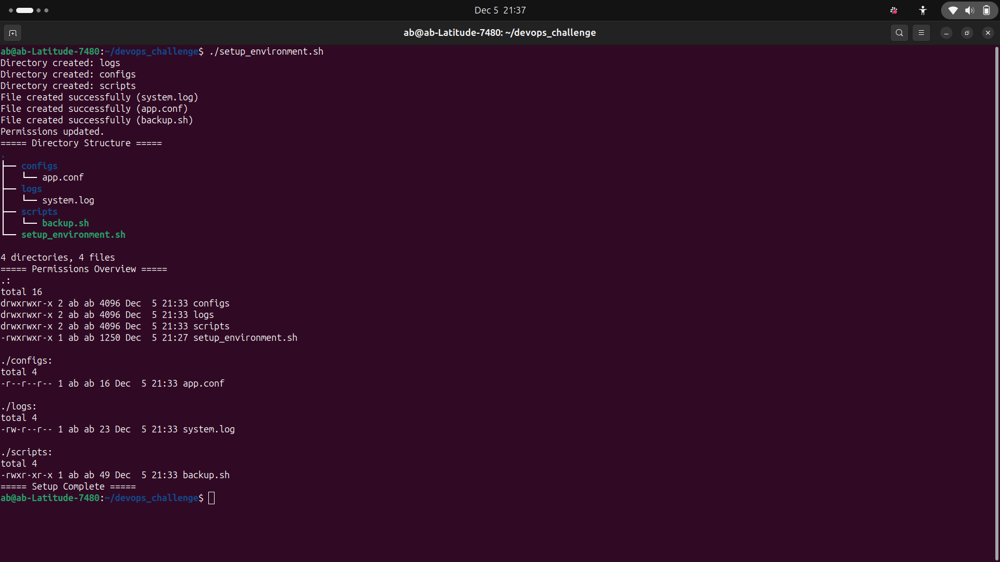

# SysAdmin Starter Pack

A minimal Bash script to scaffold a small Linux administration workspace. It creates a basic directory structure, adds sample files, and sets secure permissions so you can get started quickly or use the script as a teaching example.

## What the script does
- Creates the directory structure:
  - logs/
  - configs/
  - scripts/
- Creates sample files with starter content:
  - logs/system.log
  - configs/app.conf
  - scripts/backup.sh
- Applies recommended permissions:
  - logs/system.log -> 644 (-rw-r--r--)
  - configs/app.conf -> 444 (-r--r--r--)
  - scripts/backup.sh -> 755 (-rwxr-xr-x)
- Prints the workspace layout (prefers `tree` if available; falls back to `find`) and shows permissions via `ls -lR`.

## Usage
1. Make the script executable:
   chmod +x setup_environment.sh

2. Run the script:
   ./setup_environment.sh

By default the script creates the workspace at `~/devops_challenge` and prints progress messages to stdout.

## Behavior and safety
- Non-destructive: the script does not overwrite existing files or directories. Existing items are reported and left intact.
- Re-runnable: safe to run multiple times; the script will create missing pieces and skip existing ones.

## Expected outcome
The screenshots in the `screenshots/` directory illustrate the expected results after running the script: created directories, sample files with starter content, and their permissions.

- Directory structure and permissions:
  

- File creation and sample content:
  

## Troubleshooting
- If the script fails due to permissions, run it from a user account with appropriate filesystem permissions (avoid running as root unless required).
- If `tree` is not installed, the script falls back to using `find` to produce the directory listing.
- Verify output messages if an expected file or directory is missing.

